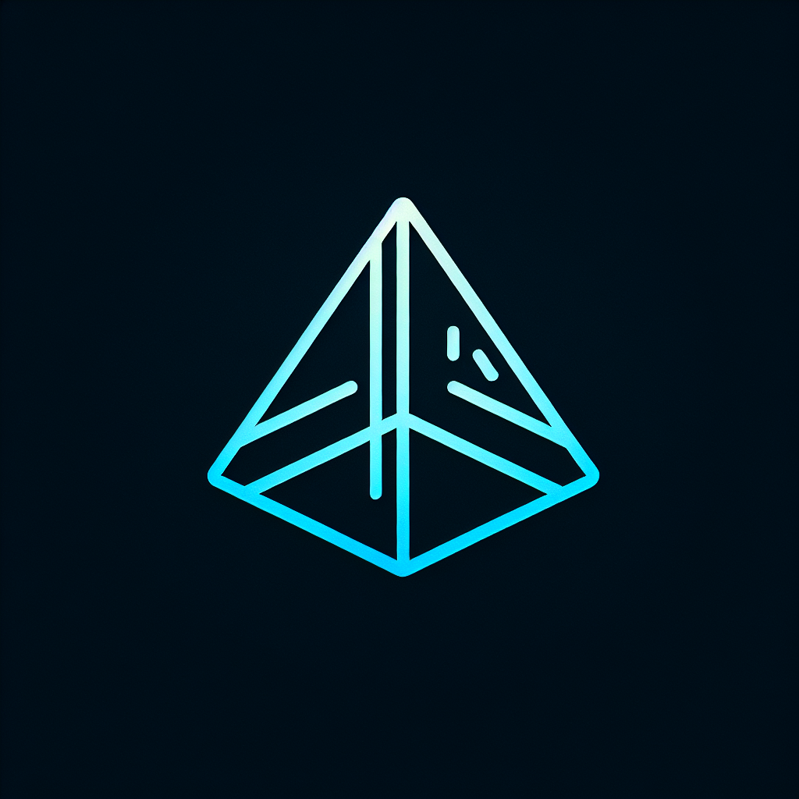

# Fractal - Software Development Company Website

A modern, responsive website for Fractal software development company featuring a clean design and proper GitHub Pages deployment setup.



## Features

- ✅ Modern, clean design with branded color scheme
- ✅ Fully responsive for all device sizes
- ✅ Animated sections using Framer Motion
- ✅ Contact form with validation
- ✅ Dark/light mode support
- ✅ Optimized for GitHub Pages deployment

## Technology Stack

- React
- TypeScript
- Tailwind CSS
- Framer Motion
- shadcn/ui components
- Vite

## Local Development

### Prerequisites

- Node.js
- npm

### Setup

1. Clone the repository
   ```bash
   git clone https://github.com/your-username/fractal.git
   cd fractal
   ```

2. Install dependencies
   ```bash
   npm install
   ```

3. Start the development server
   ```bash
   npm run dev
   ```

4. Open [http://localhost:5000](http://localhost:5000) in your browser

## Deployment to GitHub Pages

### Automatic Deployment

This project is configured with GitHub Actions for automatic deployment to GitHub Pages. When you push to the `main` branch, the site will automatically build and deploy.

### Setup GitHub Pages

1. Push your code to GitHub
2. Go to your repository's Settings
3. Navigate to "Pages" in the sidebar
4. Under "Source", select "GitHub Actions"
5. The site will be deployed to `https://your-username.github.io/fractal/`

### Manual Deployment

If you prefer to deploy manually:

1. Build the project
   ```bash
   npm run build
   ```

2. The built files will be in the `dist/public` directory
3. Copy these files to your GitHub Pages repository

## Customization

### Colors

You can customize the color scheme by editing the variables in `client/src/index.css`:

```css
:root {
  --primary: 245 100% 60%;  /* Main brand color */
  --secondary: 240 100% 59%;  /* Secondary brand color */
  --accent: 142 71% 45%;  /* Accent color for highlights */
  /* ... other colors ... */
}
```

### Content

Update the content in the following files:

- Company data: `client/src/lib/utils.ts`
- Section components: `client/src/components/`

## License

MIT

## Credits

Developed by Fractal Zeta
